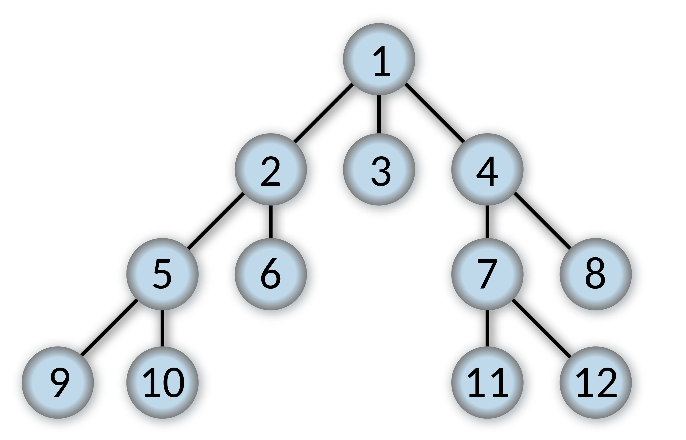
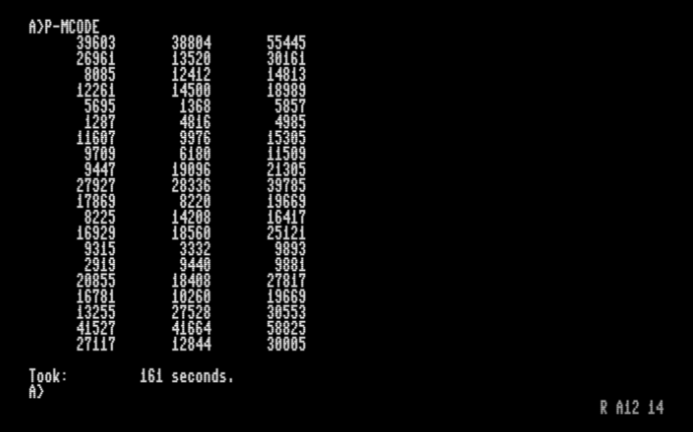

# Triple pitagoriche - sfida di #8brpi

Questo progetto nasce come risposta alla sfida lanciata dalla pagina facebook [**8bpri**](https://www.facebook.com/groups/programming.c64/) di scrivere un programma per una piattaforma 8 bit che trovi le prime 1000 triplette pitagoriche: a [**questo link**](https://sys64738.org/wp-content/uploads/2019/06/00_TriplettePitagoriche.pdf) c'è la traccia completa della sfida.

## Perché Turbo Modula-2?
La scelta è dettata principalmente da ragioni di interesse storico: questo compilatore (mai distribuito ufficialmente da Borland) [è stato scritto da Martin Odersky](https://groups.google.com/forum/?fromgroups=#!topic/comp.lang.modula2/Ruy9g8aBmF0) (l'inventore di [Scala language](http://www.scala-lang.org/)) e non è mai stato usato da una massa critica di utenti. Pertanto è sia una scelta "sfidante" che un motivo per una ricerca filologica.

## Struttura del repository
- **source** - Codice sorgente in Turbo Modula-2
  - [**pythagor.mod**](https://github.com/sblendorio/pythagorean-triples/blob/master/source/pythagor.mod) - Sorgente della soluzione alla "sfida".
- **binary** - File .COM eseguibili su sistemi CP/M-80
  - [**p-mcode.com**](https://github.com/sblendorio/pythagorean-triples/blob/master/binary/p-mcode.com) Eseguibile compilato in "mcode"
  - [**p-native.com**](https://github.com/sblendorio/pythagorean-triples/blob/master/binary/p-native.com) Eseguibile compilato in codice nativo
- **dists** - Raccolta di immagini di dischi CP/M per Commodore 64 (con scheda Z80) e Commodore 128 (incluso codice di boot di sistema)
  - [**pythagoras64.d64**](https://github.com/sblendorio/pythagorean-triples/blob/master/dists/pythagoras64.d64) - Disco per C64 (con scheda Z80), include sorgente e binari
  - [**pythagoras128.d64**](https://github.com/sblendorio/pythagorean-triples/blob/master/dists/pythagoras128.d64) - Disco per C128, include sorgente, binari e sistema minimale per il boot

## Tecnica utilizzata: *Breadth Search*
La soluzione consiste nell'applicazione del *teorema di Barning*, che consente di ottenere tutte le terne pitagoriche avendo come input una di partenza, che tipicamente è la minimale *(3, 4, 5)*. Ciò implica l'esplorazione di un albero infinito, pertanto diventa impossibile una sua esplorazione in termini di "Depth-Search", dato che questa tecnica presuppone un numero di nodi *finito*:

Viceversa, l'esplorazione è da effettuare *in larghezza*, tutti i nodi di un livello, prima di passare al successivo:

Ciò è stato implementato tramite una struttura a *coda* (**queue**):

    PROCEDURE DoBreadthSearch();
    VAR value: VECTOR;
        r: RESULTS;
        i: CARDINAL;
    BEGIN
        WHILE count < 1000 DO
            INC(count);
            Pull(value);
            IF count >= 981 THEN
               INC(lines);
               Assign(output[lines], value);
            END;
            GetNext3(value, m, r);
            FOR i := 1 TO 3 DO
                Push(r[i])
            END
        END
    END DoBreadthSearch;

Da notare il limite (1000) imposto nel ciclo *WHILE*: senza questo limite non ci sarebbe (teoricamente) termine all'algoritmo, dato che l'albero da esplorare è *infinito*.

**NOTA**: Per ottenere una *Depth Search* (ricerca in profondità), ammesso che l'albero da esplorare sia *finito*, è sufficiente utilizzare una struttura dati a *pila* (**push-pop**) anziché a *coda* (**push-pull**).

## CP/M Plus (3.0) e gestione del tempo: interrupt BDOS 105
Per la rilevazione del tempo utilizzato è stato necessario (non avendo Turbo Modula-2 funzioni native in tal senso) ricorrere agli interrupt di CP/M, in particolare all'interrupt **105** della componente **BDOS**:

    PROCEDURE GetTime(): LONGINT;
    CONST GetDT = 105; (* BDOS Function *)
    VAR dat: ARRAY[0..1] OF CARDINAL;
        hour, minute, second: INTEGER;
    BEGIN
        BDOS(GetDT,ADR(dat));
        second := BcdToDec(IORESULT);
        minute := BcdToDec(dat[1] DIV 256);
        hour   := BcdToDec(INTEGER(BITSET(dat[1])*BITSET(65535)));
        RETURN LONG(second) + (LONG(minute)*60L) + (LONG(hour)*3600L)
    END GetTime;

Tramite la chiamata **BDOS** viene richiamata la routine di sistema (disponibile solo nel CP/M 3.0, o "plus", e non nelle release precedenti come la 2.2) che restituisce:
- **IORESULT**, che contiene i secondi in formato BCD
- la variabile **dat**, che contiene nei 16 bit meno significativi, ore e minuti, concatenati e in formato BCD (quindi "packed BCD")

Tramite una funzione che fa uso di operatori *bitwise* i valori BCD vengono convertiti in decimale:

    PROCEDURE BcdToDec(n: INTEGER): INTEGER;
    BEGIN
        RETURN (INTEGER(BITSET(n) * BITSET(240)) DIV 16) * 10
              + INTEGER(BITSET(n) * BITSET(15))
    END BcdToDec;

## Risultati e prestazioni
Le prestazioni sono state misurate eseguendo il programma, sia in versione "m-code" che in codice nativo, su un emulatore di C128 in modalità CP/M
### Eseguibile nativo: 114 secondi

### Eseguibile m-code: 161 secondi

Riferimenti:
- [Manuale di Turbo Modula-2](http://web.archive.org/web/20130224124729/http://z80cpu.eu/mirrors/oldcomputers.dyndns.org/manuals/turbomodula2_bw.pdf)
- [CP/M + Turbo Modula-2: un'accoppiata interessante](https://www.retroacademy.it/2016/09/30/cpm/cpm-turbo-modula-2-accoppiata-interessante/3132/)
- [If only Borland had stuck with Turbo Modula-2 for CP/M](https://techtinkering.com/2013/03/12/if-only-borland-had-stuck-with-turbo-modula-2-for-cpm/)

